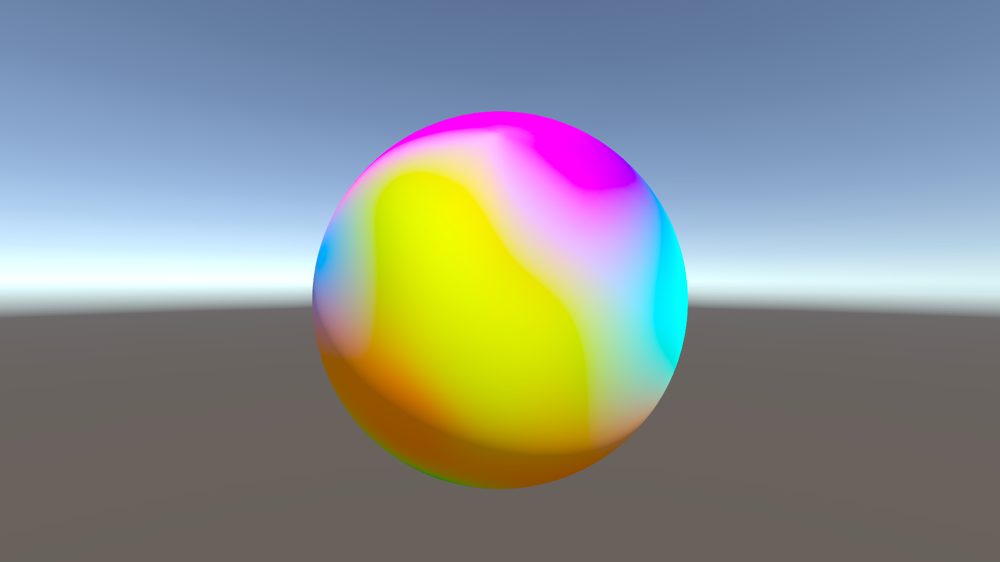

# StandardSurfWithVertexColor

A simple demo how to add vertex color support to a built-in render pipeline surface shader in Unity.

This shader supports basic surface shader features and I also added a saturation adjustment control, as vertex colors often tend to look a bit bland in Unity (at least in my use-cases.)

### shader in action

